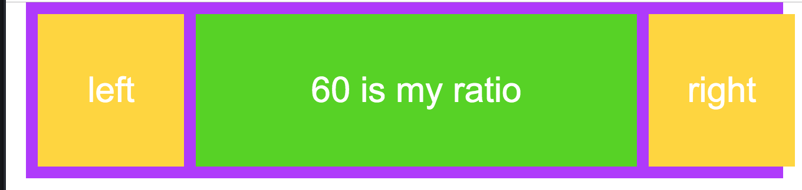
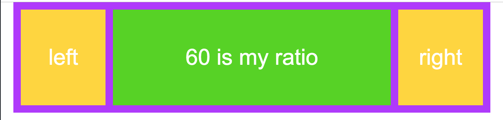

### `20% 60% 20%` is not the same like `1fr 60% 1fr`

```css
main {
            height: 150px;
            background: #B02AFF;
            display: grid;
            grid-template-columns: 20% 60% 20%;
            gap: 10px;
            padding: 10px;
        }
```


```css
main {
            height: 150px;
            background: #B02AFF;
            display: grid;
            grid-template-columns: 1fr 60% 1fr;
            gap: 10px;
            padding: 10px;
        }
```


